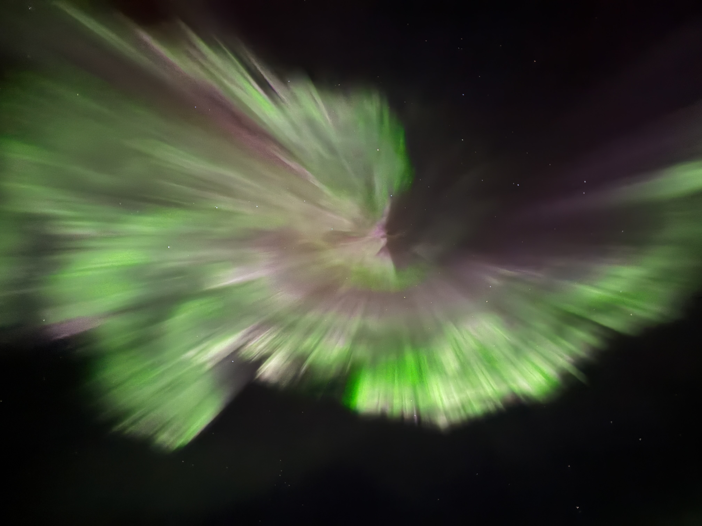

## My Hobbies

### Reading
One of my favorite hobbies is reading, especially books related to economics, psychology, and social issues. I enjoy exploring how people make decisions and how society changes through policy, culture, and technology. Reading also helps me improve my academic writing and critical thinking skills. Besides academic books, I also enjoy novels and essays because they help me relax and see different perspectives on life.

### Traveling
I enjoy traveling because it allows me to experience different cultures, lifestyles, and environments. Traveling between different cities and countries has helped me become more open-minded and adaptable. I especially enjoy visiting museums, local restaurants, and historical areas because they help me better understand how people live in different places. Traveling also inspires many of my research interests related to inequality, urban development, and public health.

### Photography
Photography is another hobby that I really enjoy. I like taking photos of cities, food, nature, and everyday moments. I am especially interested in capturing small details and different lighting conditions. Photography helps me observe the world more carefully and creatively. I often use photos to document my travels and daily experiences, and I enjoy editing and organizing them afterward.
